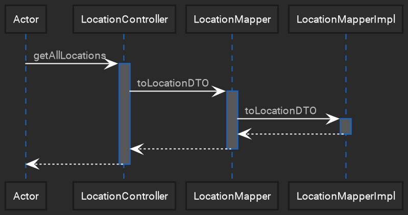
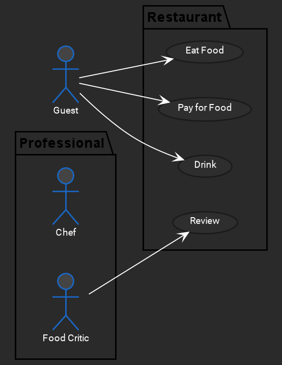
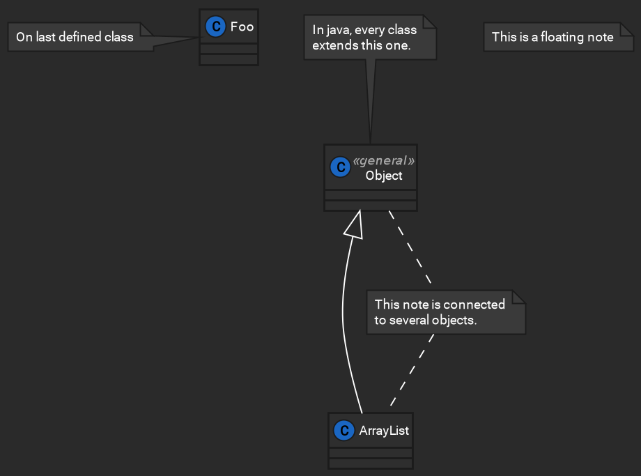

## How to use

Add the following two lines under @startuml

```
!define DEFAULT
!includeurl https://raw.githubusercontent.com/JustMilan/plantuml-styles/main/style.puml
```

## Examples

```
@startuml
' Add the two lines below for the styling
!define DEFAULT
!includeurl https://raw.githubusercontent.com/JustMilan/plantuml-styles/main/style.puml

' example sequence diagram
participant Actor
Actor -> LocationController : getAllLocations
activate LocationController
LocationController -> LocationMapper : toLocationDTO
activate LocationMapper
LocationMapper -> LocationMapperImpl : toLocationDTO
activate LocationMapperImpl
LocationMapperImpl --> LocationMapper
deactivate LocationMapperImpl
LocationMapper --> LocationController
deactivate LocationMapper
return
@enduml
 ```



```
@startuml
' Add the two lines below for the styling
!define DEFAULT
!includeurl https://raw.githubusercontent.com/JustMilan/plantuml-styles/main/style.puml

left to right direction
actor Guest as g
package Professional {
  actor Chef as c
  actor "Food Critic" as fc
}
package Restaurant {
  usecase "Eat Food" as UC1
  usecase "Pay for Food" as UC2
  usecase "Drink" as UC3
  usecase "Review" as UC4
}
fc --> UC4
g --> UC1
g --> UC2
g --> UC3
@enduml
```



```
@startuml
' Add the two lines below for the styling
!define DEFAULT
!includeurl https://raw.githubusercontent.com/JustMilan/plantuml-styles/main/style.puml

class Object << general >>
Object <|--- ArrayList

note top of Object : In java, every class\nextends this one.

note "This is a floating note" as N1
note "This note is connected\nto several objects." as N2
Object .. N2
N2 .. ArrayList

class Foo
note left: On last defined class

@enduml
```


